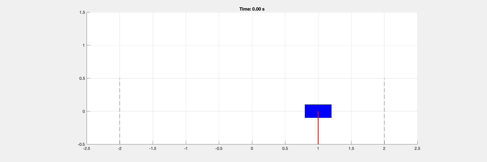
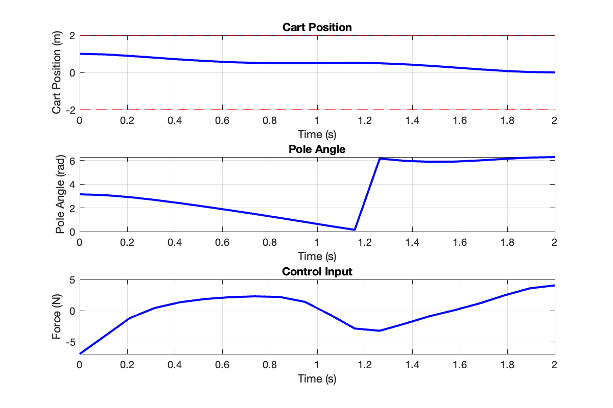

# DirectCollocation

This MATLAB code solves the cart-pole swing-up problem using direct collocation optimization. It finds an optimal trajectory to move an inverted pendulum from its downward position to upright while minimizing control effort and state error.





## Key Parameters
```matlab
% System parameters
m_c = 1.0;        % Cart mass (kg)
m_p = 0.1;        % Pole mass (kg)
l = 0.5;          % Pole length (m)

% Optimization parameters
N = 30;           % Number of intervals
tf = 2.0;         % Final time (seconds)

% Cost weights
Q = diag([10, 10, 1, 1]);  % State costs [x, theta, dx, dtheta]
R = 0.1;                   % Control cost
```

Adjust these parameters to modify the system properties and optimization behavior. Higher Q values prioritize state tracking, while higher R values make control more conservative.
